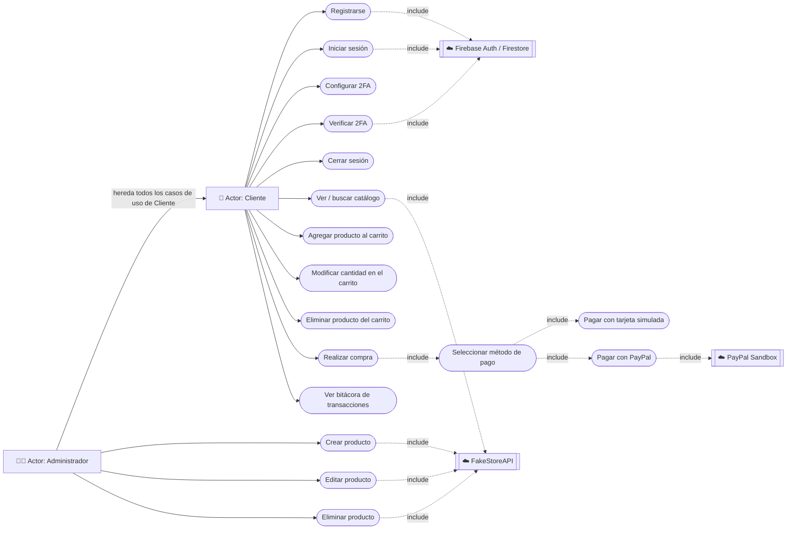

# Diagrama de casos de uso — TiendaUIA

> Mermaid no tiene un tipo de diagrama "use case" nativo, así que se modela
> con un `flowchart` usando óvalos (`([Texto])`) para los casos de uso y
> rectángulos para los actores — es la convención más común para representar
> diagramas de casos de uso con Mermaid. Para pegarlo en el informe de Word:
> abrir este bloque en https://mermaid.live/, exportar como PNG/SVG, e
> insertar la imagen.

## Descripción de los casos de uso principales

| Caso de uso | Actor | Descripción breve |
|---|---|---|
| Registrarse | Cliente | Crea una cuenta con correo y contraseña (Firebase Auth) |
| Iniciar sesión | Cliente | Inicia sesión con credenciales existentes |
| Configurar 2FA | Cliente | Al primer ingreso, genera y confirma una clave TOTP con una app autenticadora |
| Verificar 2FA | Cliente | En logins posteriores, confirma un código de 6 dígitos antes de acceder |
| Ver/buscar catálogo | Cliente | Consulta el catálogo de productos (FakeStoreAPI) y lo filtra por texto |
| Agregar/modificar/eliminar del carrito | Cliente | Gestiona los productos y cantidades de su carrito (persistido en Firestore) |
| Realizar compra | Cliente | Genera el resumen del pedido y procede al pago |
| Seleccionar método de pago | Cliente | Elige entre tarjeta simulada o PayPal Sandbox |
| Ver bitácora de transacciones | Cliente | Consulta el historial de sus propios eventos (login, compras) |
| Crear/editar/eliminar producto | Administrador | Mantenimiento del catálogo (CRUD contra FakeStoreAPI) |
