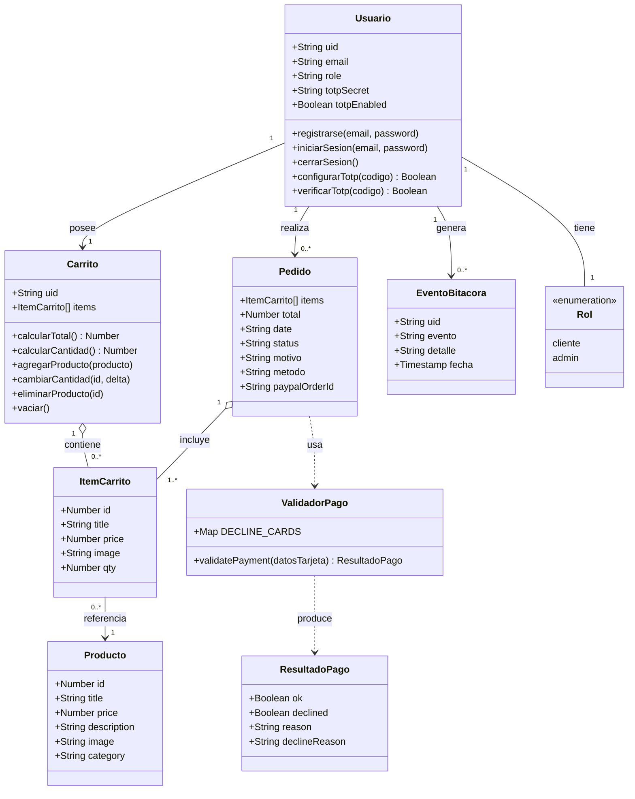

# Diagrama de clases — TiendaUIA

> Modela las entidades principales del sistema tal como existen en Firestore
> y en la lógica de la aplicación (`js/lib/*.js`). Para pegarlo en el informe:
> abrir el bloque en https://mermaid.live/, exportar como PNG/SVG.

## Notas sobre el modelo

- **Usuario**, **Carrito**, **Pedido** y **EventoBitacora** se persisten en
  Cloud Firestore, en las colecciones `users/{uid}`, `carts/{uid}`,
  (los pedidos no se guardan en una colección aparte en la versión actual,
  solo se registra su resultado en `bitacora`) y `bitacora` respectivamente.
- **Producto** no es una entidad propia del sistema: proviene de FakeStoreAPI
  y se trata como un objeto de solo lectura para el cliente (ver
  `js/catalog.js`) y de lectura/escritura para el administrador
  (`js/admin.js`).
- **ValidadorPago** corresponde al módulo puro `js/lib/payment.js`,
  desacoplado del DOM para poder probarse con Jest de forma aislada.
- **Rol** se modela como una enumeración simple (`"cliente"` | `"admin"`)
  almacenada como cadena en el documento del usuario, no como una clase
  independiente en Firestore.
