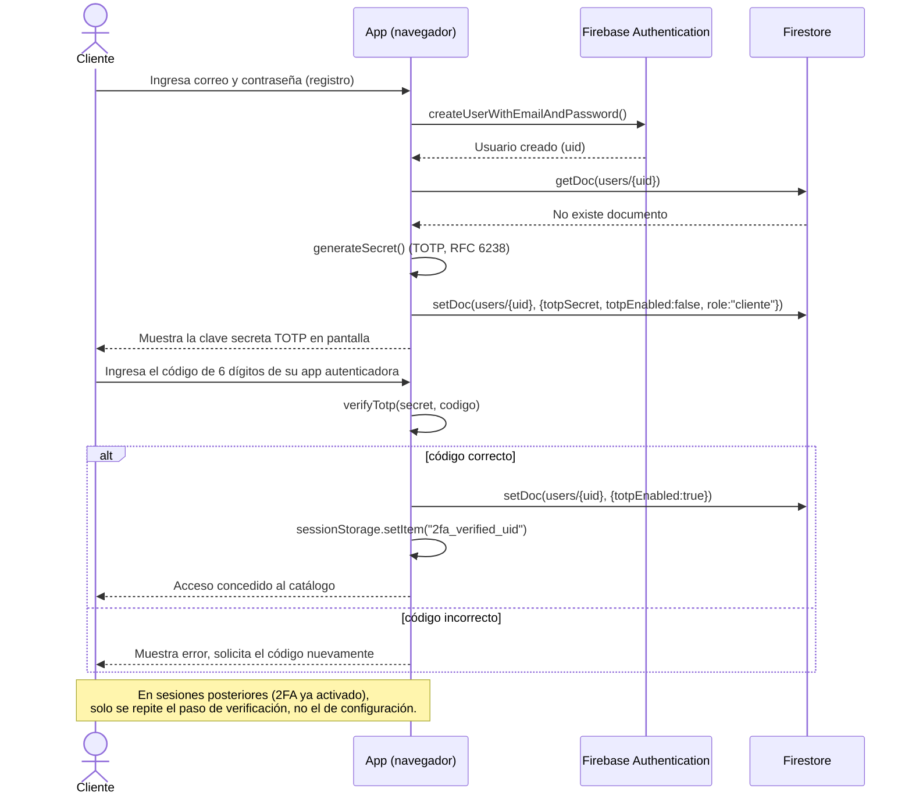
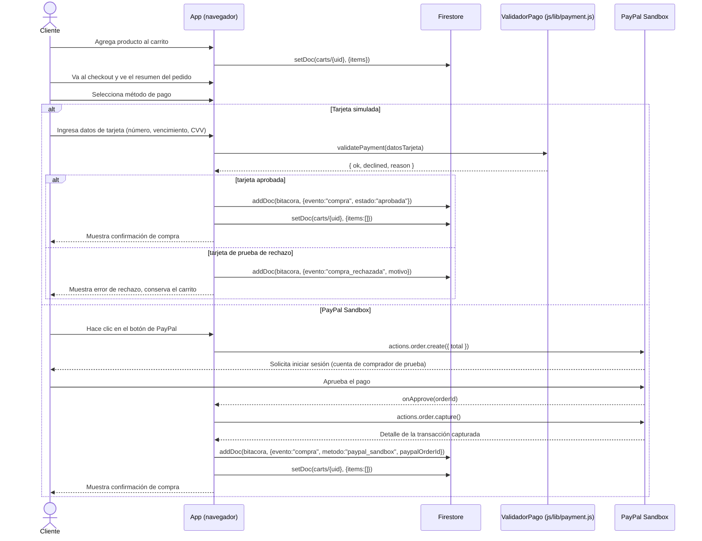

# Diagramas de secuencia — TiendaUIA

Se documentan los dos flujos más complejos del sistema. Para pegarlos en el
informe: abrir cada bloque en https://mermaid.live/, exportar como PNG/SVG.

## 1. Registro, configuración y verificación de 2FA

## 2. Proceso de compra (tarjeta simulada o PayPal Sandbox)

